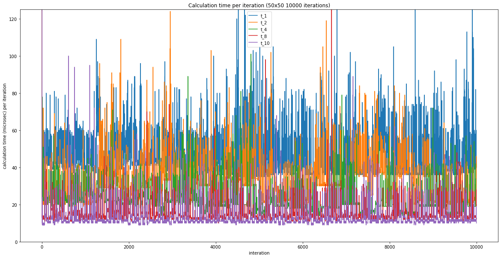
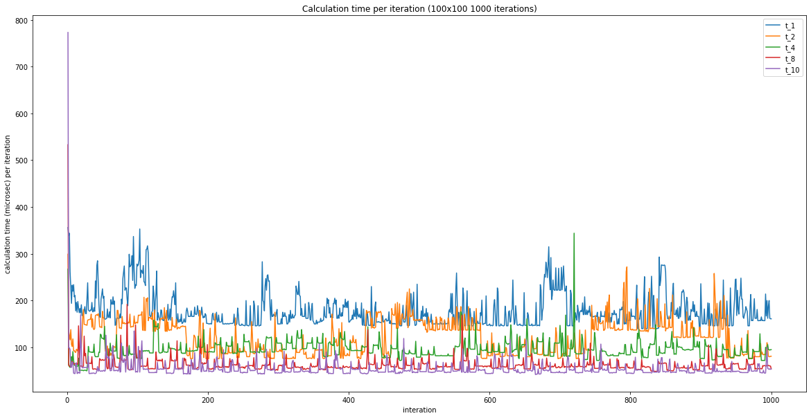

# Parallel Programming - Final Project - Game Of Life

### Student 1: Thomas Stummer Student 2: Thomas Bründl

# 1. Explain the problem domain

The universe of the Game of Life is an infinite, two-dimensional orthogonal grid of square cells, each of which is in one of two possible states, live or dead (or populated and unpopulated, respectively). Every cell interacts with its eight neighbours, which are the cells that are horizontally, vertically, or diagonally adjacent. At each step in time, the following transitions occur:

1. Any live cell with fewer than two live neighbours dies, as if by underpopulation.
2. Any live cell with two or three live neighbours lives on to the next generation.
3. Any live cell with more than three live neighbours dies, as if by overpopulation.
4. Any dead cell with exactly three live neighbours becomes a live cell, as if by reproduction.
     

These rules, which compare the behaviour of the automaton to real life, can be condensed into the following:

- Any live cell with two or three live neighbours survives.
- Any dead cell with three live neighbours becomes a live cell.
- All other live cells die in the next generation. Similarly, all other dead cells stay dead.

The initial pattern constitutes the seed of the system. The first generation is created by applying the above rules simultaneously to every cell in the seed, live or dead; births and deaths occur simultaneously, and the discrete moment at which this happens is sometimes called a tick. Each generation is a pure function of the preceding one. The rules continue to be applied repeatedly to create further generations.

 

# 2. Point out parts of the program/algorithm which could be parallelized

 
We used a parallel for loop to parallize every new cell state calculation.

 
 

 

# 3. Analyse what parallel techniques/patterns could be used and argue why you used your specific technique or possibly why obvious solutions did not work out.

 

We chose to split the board in lines and directed omp to take care of the thread scheduling.
Another valid option would be to span two tasks and assign each half of the board. This step could have been repeated recursively until a predefined threshold depth would be reached. We choose the first option because it is simpler and more straight forward.

 

# 4. What is the expected speedup? What did you achieve? Why is your result better/worse than expected?

  
It can be seen, that the most efficient speedup can be achieved by using 2 to 4 threads. After 4 threads the speed up decreases. At 8 threads another decrease in the slope can be seen. Only little speedup gains can be achieved by using 10 threads compared to 8 threads. However, the speedup quotient is quite linear until the number of threads used reaches nearly the maximum number of available (logical) CPU cores.

## Iteration time (50x50 10000 Iterations)

## Mean Time - Speedup (50x50 10000 Iterations)

## Iteration time (500x500 1000 Iterations)

## Mean Time - Speedup (500x500 1000 Iterations)

## Iteration time (100x100 1000 Iterations)

## Mean Time - Speedup (100x100 1000 Iterations)

 
